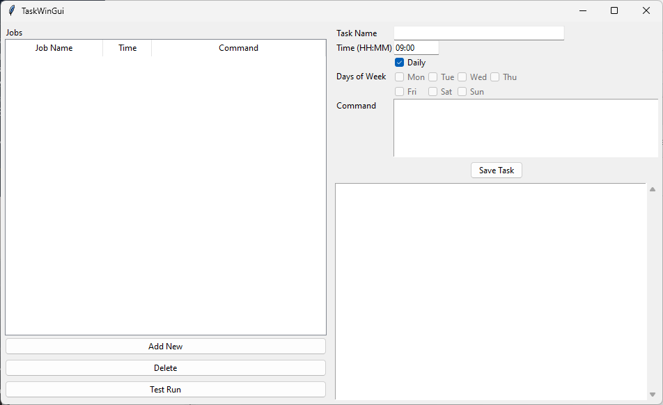

# Tk Task Scheduler

A lightweight **Tkinter-based GUI** for managing Windows scheduled tasks using the built-in `schtasks` command. This tool allows you to easily add, edit, delete, and test scheduled jobs with a simple graphical interface.



## 🚀 Features

* Add, edit, and delete Windows scheduled tasks.
* Supports both **daily** or **day-of-week** scheduling (mutually exclusive).
* Handles **command paths with spaces** automatically.
* Multi-column job list: **Job Name**, **Time**, **Command**.
* Test Run button — execute a job immediately.
* Saves job data in `%APPDATA%/TkTaskScheduler/db.json`.

## 🧩 Requirements

* Windows 10 / 11
* Python 3.8 or higher
* Built-in `schtasks` command (available by default on Windows)

## 📦 Dependencies

Uses only Python standard libraries:

* `tkinter`
* `json`
* `subprocess`
* `os`, `pathlib`, `threading`

No third-party packages required.

## 💻 Installation & Usage

1. **Clone this repository:**

   ```bash
   git clone https://github.com/yourusername/tk-task-scheduler.git
   cd tk-task-scheduler
   ```

2. **Run the app:**

   ```bash
   python tk_task_scheduler.py
   ```

3. The GUI window will open, displaying your existing scheduled tasks.

4. You can:

   * Add a new job (specify name, time, schedule type, and command)
   * Edit or delete existing jobs
   * Test run a job immediately

## ⚙️ Building an EXE

To build a standalone executable using **PyInstaller**:

```bash
pip install pyinstaller
pyinstaller --noconsole --onefile tk_task_scheduler.py
```

The compiled `tk_task_scheduler.exe` will be found in the `dist/` folder.
You can place it in the Startup folder to auto-launch on system boot.

## 🗂️ App Data

All jobs and settings are stored here:

```
%APPDATA%/TkTaskScheduler/db.json
```

Your configuration will persist between sessions.

## 🧠 Troubleshooting

* If your command contains spaces (e.g. `C:\Program Files\App\app.exe`), put your command and arguments in .bat file to ensure compatibility with `schtasks`.
* Make sure to run the app with sufficient privileges if scheduling system-level tasks.

## 🪪 License

MIT License

---
